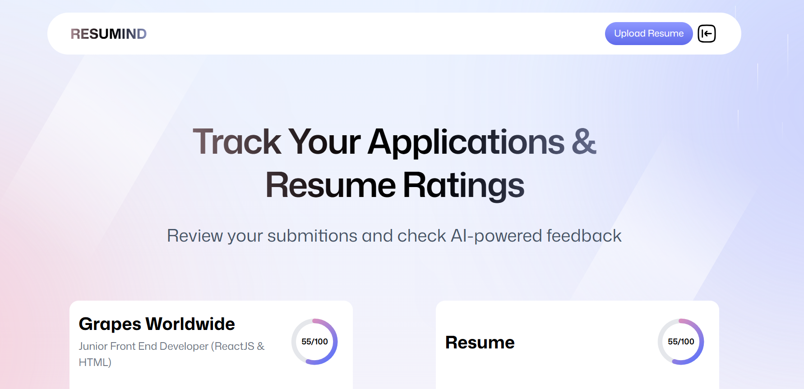

# RESUMIND - AI-Powered Resume Analyzer

## Overview

RESUMIND is an innovative AI-powered resume analysis tool designed to help job seekers optimize their resumes for better success in their job applications. This project was developed as part of a college project to demonstrate the practical application of modern web technologies and artificial intelligence in solving real-world problems.



## Features

- 🤖 **AI-Powered Analysis**: Advanced resume analysis using artificial intelligence
- 📊 **Comprehensive Scoring**: Detailed scoring across multiple categories:
  - ATS (Applicant Tracking System) Compatibility
  - Tone and Style
  - Content Quality
  - Structure
  - Skills Assessment
- 📱 **Responsive Design**: Full mobile and desktop compatibility
- 🔐 **Secure Authentication**: User authentication and data protection
- � **PDF Support**: Native PDF file handling and conversion
- 💾 **Cloud Storage**: Secure storage of resumes and analysis results

## Technology Stack

- **Frontend**: React with TypeScript
- **Routing**: React Router v7
- **Styling**: TailwindCSS with custom animations
- **PDF Processing**: PDF.js
- **Authentication**: Puter Auth
- **Storage**: Puter File System & KV Store
- **AI Integration**: Puter AI Services

## Getting Started

### Prerequisites

- Node.js 18.0 or higher
- npm or yarn package manager

### Installation

1. Clone the repository:
```bash
git clone https://github.com/HTGA75/ai-resume-analyzer.git
cd ai-resume-analyzer
```

2. Install dependencies:
```bash
npm install
```

3. Start the development server:
```bash
npm run dev
```

The application will be available in your default web browser once started.

## Project Structure

```
resumind/
├── app/                    # Main application code
│   ├── components/         # Reusable UI components
│   ├── lib/               # Utility functions and services
│   ├── routes/            # Application routes
│   └── styles/            # CSS and styling files
├── public/                # Static assets
├── types/                 # TypeScript type definitions
└── constants/             # Application constants
```

## Key Components

- **Resume Analysis**: Provides detailed feedback on resume content and structure
- **ATS Compatibility**: Checks how well your resume works with ATS systems
- **Score Visualization**: Interactive gauges and badges for score representation
- **PDF Processing**: Converts and displays PDF resumes with high fidelity

## Future Enhancements

- [ ] Enhanced AI analysis capabilities
- [ ] Resume template suggestions
- [ ] Job market insights integration
- [ ] Multi-language support
- [ ] Expanded scoring metrics

## Contributing

Contributions are welcome! Please feel free to submit a Pull Request.

## License

This project is licensed under the MIT License - see the LICENSE file for details.

## Acknowledgments

- React Router team for the routing framework
- TailwindCSS team for the styling system
- Puter.com for authentication and AI services
- PDF.js contributors for PDF handling capabilities

## Author

Harshit Gupta
- GitHub: [@HTGA75]
